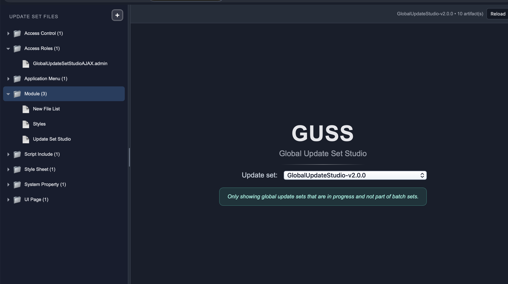
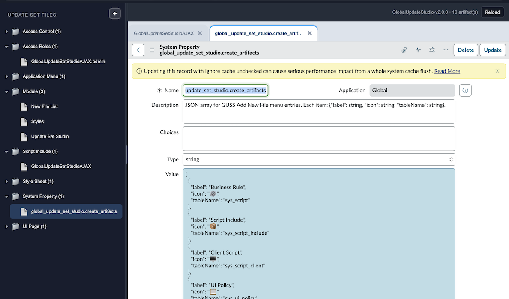
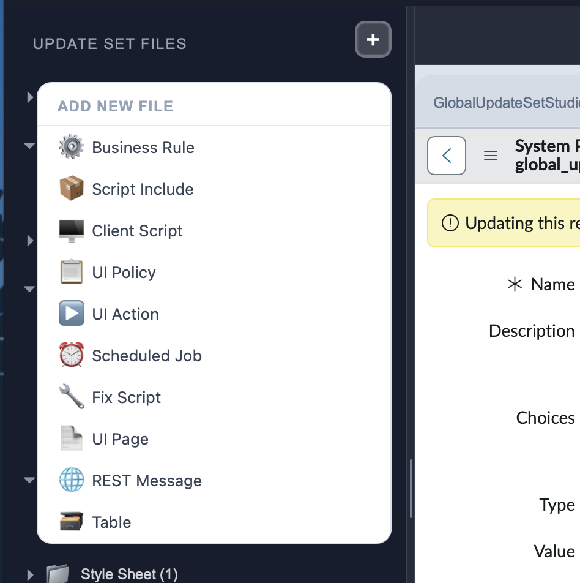
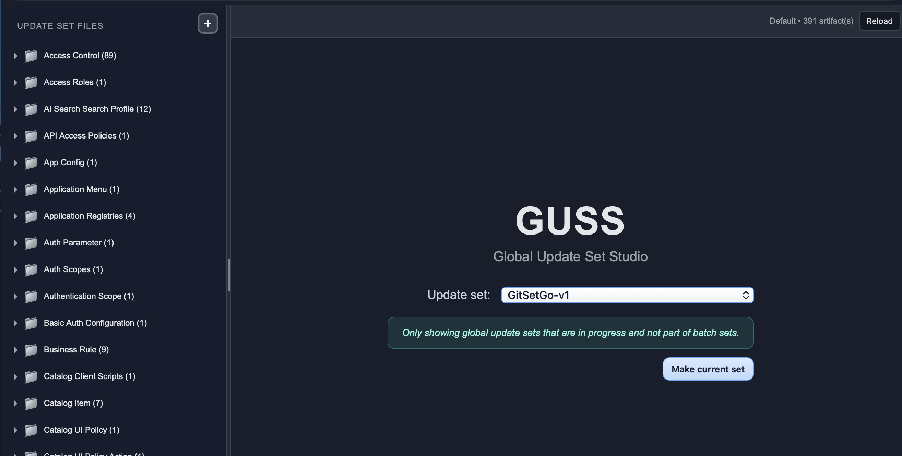

# GUSS (Global Update Set Studio)

GUSS is a ServiceNow UI page that helps developers browse and work with update-set artifacts in one place.

## What it does

- Shows the current update set artifacts in a collapsible tree
- Groups artifacts by type, with each type acting like a folder
- Opens records in tabs inside the page
- Supports creating new artifacts from a configurable menu
- Lets you switch the current update set from inside the page

## Design notes

- The client script uses mostly browser-native JavaScript and direct request handling
- CSS is stored in a shared `content_css` record instead of the UI page itself
- Artifact menu options come from a `sys_properties` record so they can be changed without editing the page
- The page is tuned for global, in-progress update sets that are not part of batch sets

## Installation

- The XML file is an update set.

## Screenshots

## Current status

The app is in beta.
